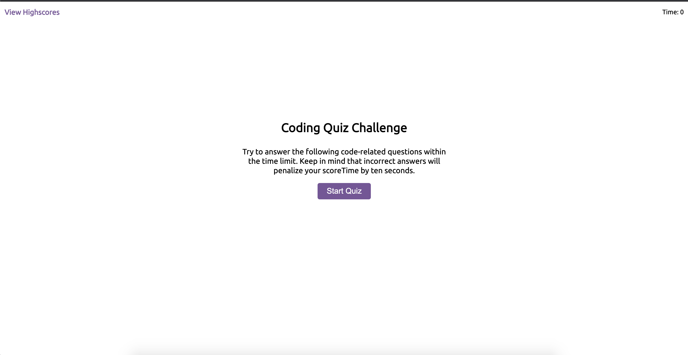

# Project name: Coding Quiz

A dynamically generated, timed Jacascript coding quiz with score logged to local storage and answer validation.

# Project URL

https://jennyrussell.github.io/coding-quiz/

# Project Screenshot

# License

The MIT License (MIT)